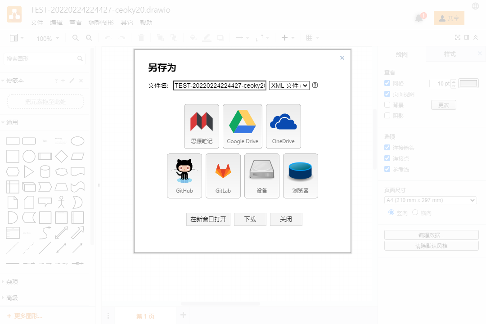

---

---
[简体中文](./README_zh_CN.md) \| English

---

# widget-drawio

A [draw.io](https://www.diagrams.net/) widget for Siyuan Notes.

## PREVIEW

## FUNCTION

To use the widget in your browser, please visit `http(s)://host:port/widgets/drawio/?id=<widget block ID>`.

For other URL parameters, please refer to [Supported URL parameters](https://www.diagrams.net/doc/faq/supported-url-parameters).

- Load and save.
  - The resource files set in the block attributes `custom-data-assets` and `data-assets` are automatically loaded on load.
  - Use `File` -> `Save` <kbd>Ctrl + S</kbd> or `Save As` <kbd>Ctrl + Shift + S</kbd> -> `SiYuan Note`  to save the resource file to the resource folder `data/assets`.
    - The currently supported save formats are `*.drawio`, `*.png`, `*.svg`, `*.html`, `*.xml`, all of which can be loaded and edited again.
      - `*.svg` files can be inserted to other locations in the notebook using `Insert image link` or `Insert IFrame link`, and can be updated synchronously when the source files change.
      - `*.png` files can be inserted to other locations in the notebook using `Insert image link` or `Insert IFrame link`, and can be updated synchronously when the source files change.
      - `*.html` files can be inserted to other locations in the notebook using `Insert IFrame link`, and can be updated synchronously when the source files change.
    - Resource file reference URL are updated to the block attributes `custom-data-assets` when saved.
    - The Save/Save As action creates a new file when the file name is changed, and the Save/Save As action updates the current file when the file name is not changed.
- Other custom block attributes
  - Presentation mode.
    - Set custom block attribute `lightbox`: `1`
    - The mode can only be viewed and cannot be edited.
    - After you delete the attribute or change the value of the property to a different value, you can exit the mode by refreshing.
  - Theme mode
    - Set custom block attribute `dark`: `0` | `1` | `auto`.
    - The default is the last used theme mode.
  - Theme
    - Set custom block attribute `ui`: `kennedy` | `min` | `atlas` | `dark` | `sketch` | `simple`.
    - The default is the last used theme.

## START

The widget has been put on the shelves at [SiYuan community bazaar](https://github.com/siyuan-note/bazaar) and can be installed directly in the Bazaar.

## REFERENCE & THANKS

| Author                                  | Project                                           | License                                                                   |
| :-------------------------------------- | :------------------------------------------------ | :------------------------------------------------------------------------ |
| **[JGraph](https://github.com/jgraph)** | [jgraph/drawio](https://github.com/jgraph/drawio) | *[Apache-2.0 License](https://github.com/jgraph/drawio/blob/dev/LICENSE)* |

ps: Sort in no particular order.

## CHANGE LOG

[CHANGELOG.md](./CHANGELOG.md)
