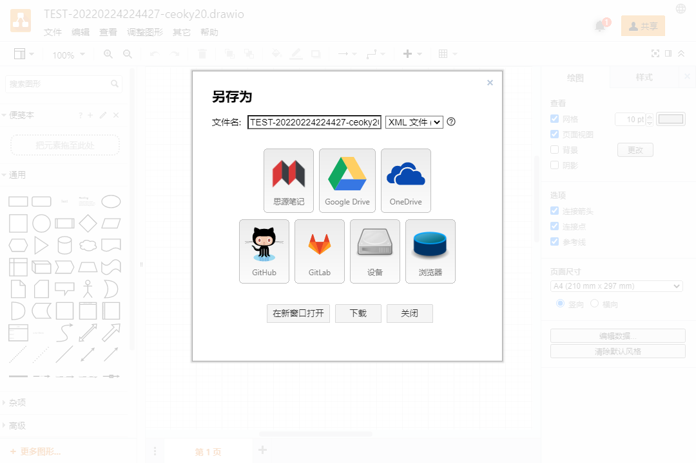

---

---
简体中文 \| [English](./README.md)

---

# widget-drawio

一个适用于思源笔记的 [draw.io](https://www.diagrams.net/) 挂件

## 预览

## 功能

若想在浏览器中使用该挂件, 请访问 `http(s)://host:port/widgets/drawio/?id=<挂件块ID>`

其他 URL 参数请参考 [Supported URL parameters](https://www.diagrams.net/doc/faq/supported-url-parameters)

- 加载与保存
  - 加载时自动加载块属性 `custom-data-assets` 与 `data-assets` 中设置的资源文件
  - 使用 `文件` -> `保存` <kbd>Ctrl + S</kbd> 或 `另存为` <kbd>Ctrl + Shift + S</kbd> -> `思源笔记` 保存资源文件至资源文件夹 `data/assets`
    - 目前支持保存的格式有 `*.drawio`, `*.png`, `*.svg`, `*.html`, `*.xml`, 均可再次加载并编辑
      - `*.svg` 文件可以使用 `插入图片链接` 或 `插入 IFrame 链接` 的形式插入到笔记本的其他位置, 源文件更改时可以同步更新
      - `*.png` 文件可以使用 `插入图片链接` 或 `插入 IFrame 链接` 的形式插入到笔记本的其他位置, 源文件更改时可以同步更新
      - `*.html` 文件可以使用 `插入 IFrame 链接` 的形式插入到笔记本的其他位置, 源文件更改时可以同步更新
    - 资源文件引用 URL 保存时会更新至块属性 `custom-data-assets`
    - 文件名更改后保存/另存为动作会新建一个文件, 文件名不更改时保存/另存为动作会更新当前文件
- 其他自定义块属性
  - 展示模式
    - 设置自定义块属性 `lightbox`: `1`
    - 该模式只能查看不能编辑
    - 删除该属性或更改该属性值为其他值后刷新可以退出该模式
  - 主题模式
    - 设置自定义块属性 `dark`: `0` | `1` | `auto`
    - 默认为上一次使用的主题模式
  - 主题
    - 设置自定义块属性 `ui`: `kennedy` | `min` | `atlas` | `dark` | `sketch` | `simple`
    - 默认为上一次使用的主题

## 开始

该挂件已在[思源笔记社区集市](https://github.com/siyuan-note/bazaar)上架, 可直接在集市中安装

## 参考 & 感谢

| 作者                                    | 项目                                              | 许可证                                                                    |
| :-------------------------------------- | :------------------------------------------------ | :------------------------------------------------------------------------ |
| **[JGraph](https://github.com/jgraph)** | [jgraph/drawio](https://github.com/jgraph/drawio) | *[Apache-2.0 License](https://github.com/jgraph/drawio/blob/dev/LICENSE)* |

注: 排序不分先后

## 更改日志

[CHANGELOG.md](./CHANGELOG.md)
